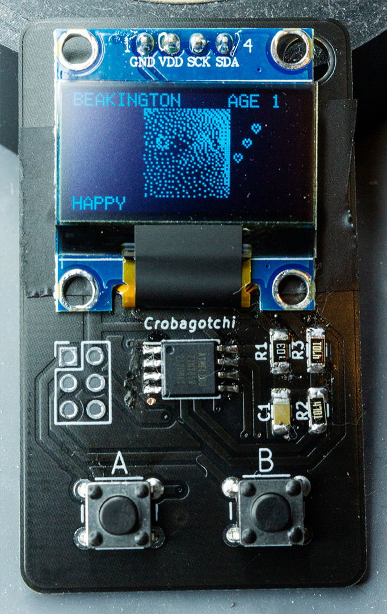
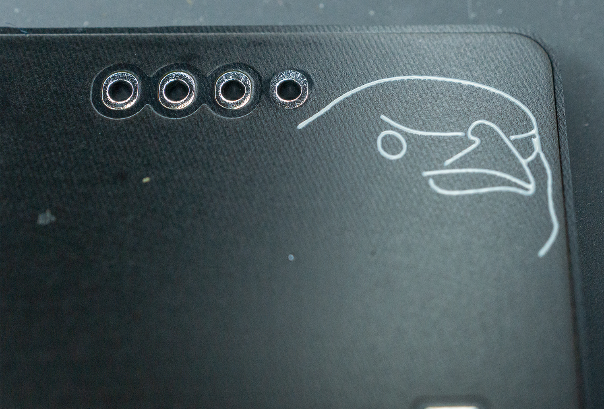
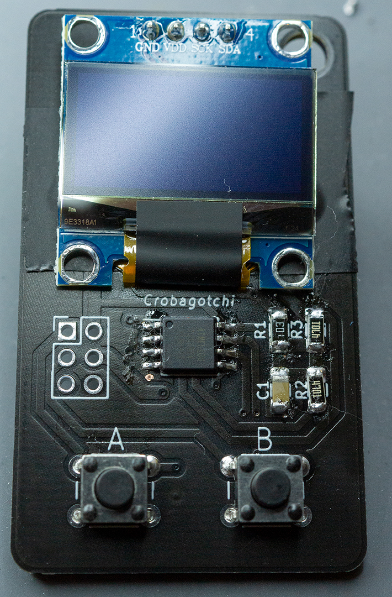
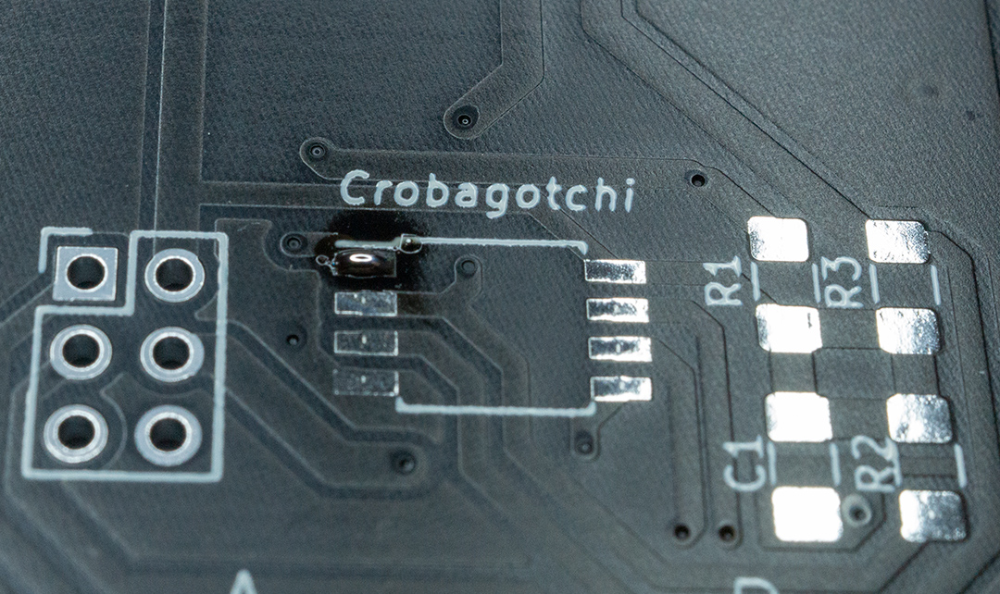
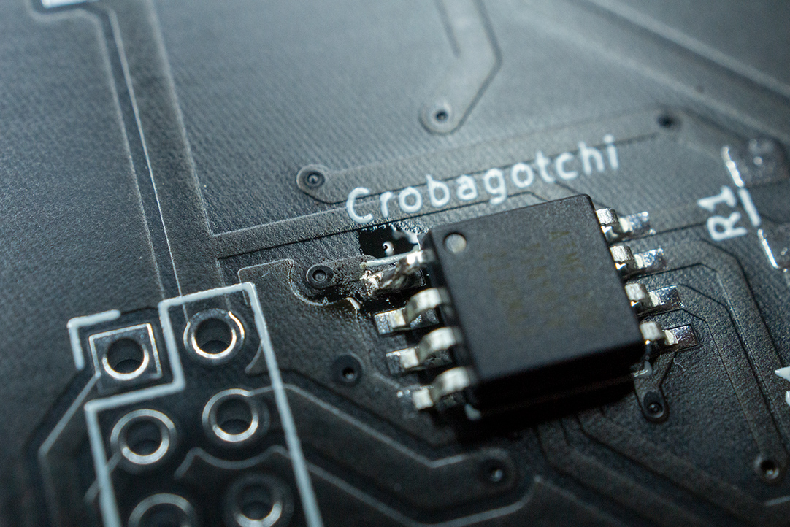
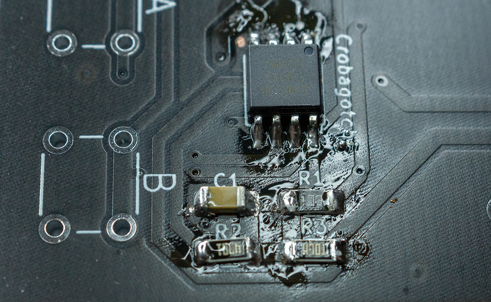
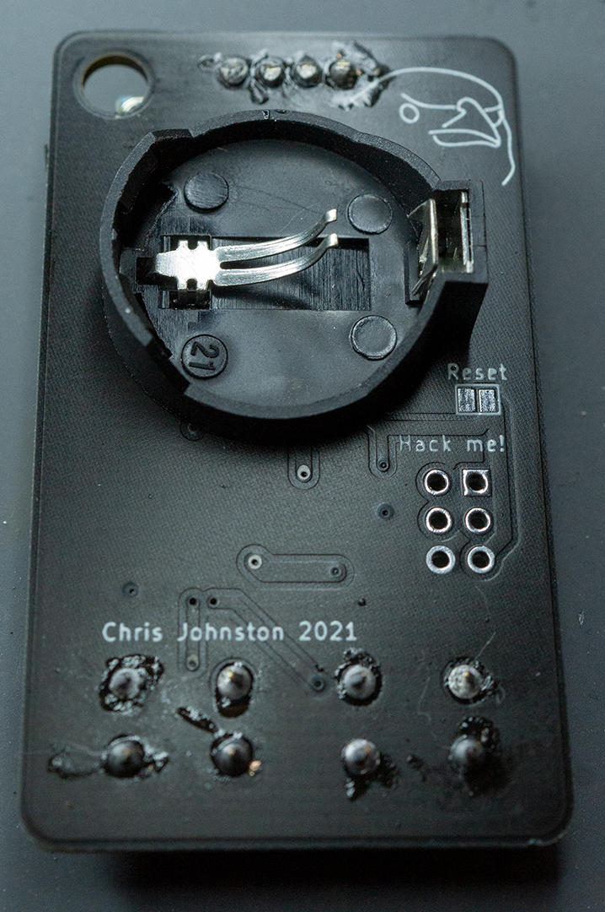
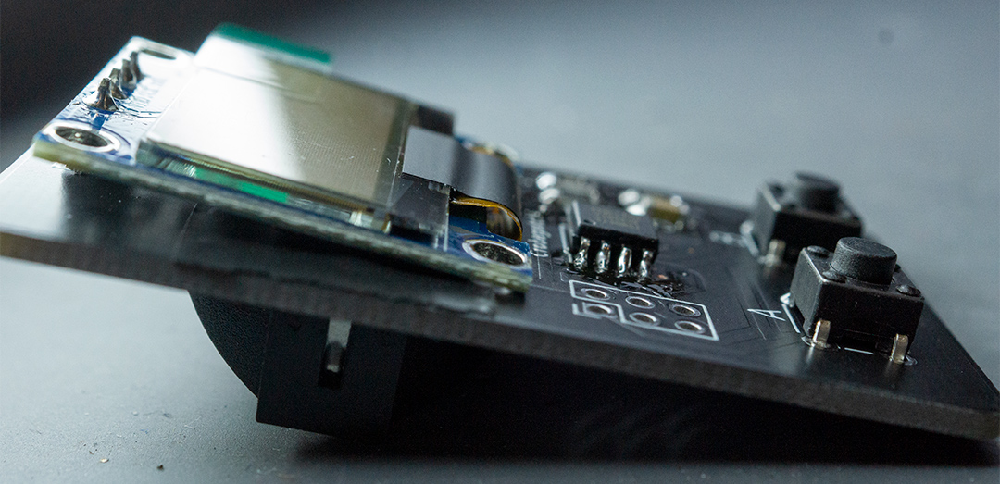
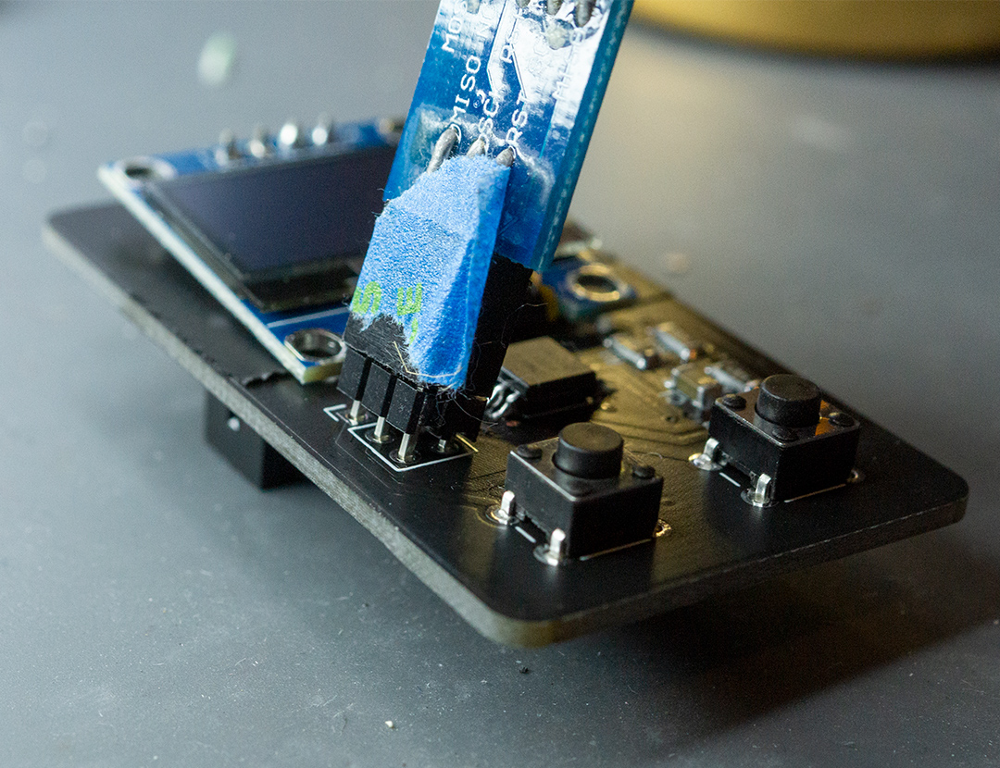
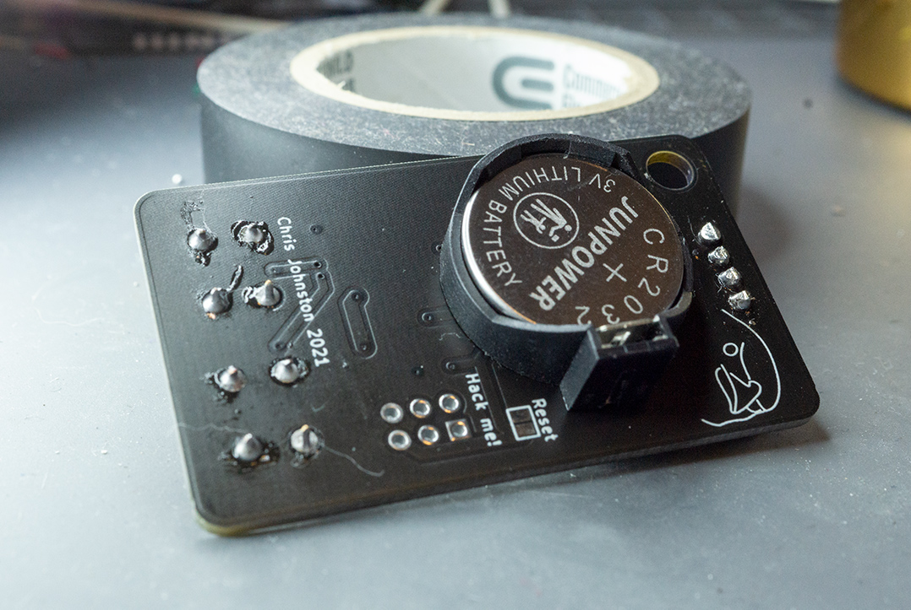

# Crobagotchi

Raise your own _virtual_ crow!

## What?

_Crobagotchi_ combines [Tamagotchi] with the [Crow of Judgement] (also referred to as a "Crob").

It's a portable handheld virtual pet which runs on an ATTiny85 and uses a SSD1306 OLED display
powered by a coin cell battery. The custom boards were designed using KiCad and [svg2mod], and the sprite work was done with Aseprite, GIMP, and [image2cpp].

## Why?

[Last year I made a PCB Crow of Judgement](https://github.com/Chris-Johnston/CrowOfJudgement), and this year I wanted to iterate on that. Eventually, I got the idea to make a knockoff Tamagotchi, and so I figured this would be a great time to do so.

[I still did make a simpler ornament this year, in the shape of an snowflake.](https://github.com/Chris-Johnston/snowflake-ornament) A lof of the board design is similar, it also uses ATTiny85.

## What else?

Battery life was a key concern, and so for this project I put a fair bit of time in to make sure
that wouldn't be a problem.

- Data is saved to EEPROM, so if the battery dies the state is preserved.
- Features of the ATTiny85 are disabled when unused, like the ADC.
- I use the deep sleep mode combined with the Watchdog Timer Interrupt to track realtime seconds (ticks once every 8 seconds), so that real time gets tracked as the device is sleeping.
- The SSD1306 is shut off as well during sleep to conserve power.

The other big issue was flash storage. The ATTiny85 has 8k of flash, which is largest offered.
I did not implement any compression for sprite bitmaps, which for each byte represents 8 vertical pixels. The 48x48 pixel image of the crow is 288 bytes, there were several times when testing where I used literally every last byte available in flash.

This code is pretty messy, I have not put much effort into cleaning it up as that was not a concern.

### SSD1306 Trouble

My experience with the SSD1306 with ATTiny85 was interesting. I tried a few libraries over time, and eventually settled with [Tiny4kOLED]. This one offered a sensible library that introduce extra fluff, like a menu that I'd never use?

Most importantly, I found that there was a bit-bang i2c implementation available where I could
reassign the pins. This was very important, because I had already ordered boards which relied
on a different pinout (PCBWay took a solid month to order), and I didn't want to disconnect
the display each time I reflashed it.

I copied this bitbang implementation and modified it to use the pins I specified.

Turns out there was more than one modification I'd make to this library. It included a 6x8 px font
which was great, but there were characters that I didn't use. Because of this, I modified
this font to add extra symbols that I'd use elsewhere, without having to add more to the flash.

## Pictures / Assembly Instructions

Here's the board fully assembled:

Mind the flux and stray bits of q-tip used to clean it up.

1. First, unless already soldered, solder the ATTiny85 to the board.
To do this, I like to start by tinning pin 1, placing the IC in the right spot,
and sticking the IC in place. Then, doing the rest of the pins isn't much extra effort. Any extra solder can be removed with solder wick.

    

    

2. Then solder the surface mount components.

    | Label | Value |
    | -- | -- |
    | C1 | 0.1 uF 1206 Capacitor |
    | R1 | 10k 1206 Resistor |
    | R2, R3 | 4.7k 1206 Resistor |

    I use a similar method, where I tin one side, place the part, solder that side down, and then solder the remaining side.

    

3. Then, install the 6mm push buttons. These are straightforward.

4. Install the battery holder. The square side is the positive terminal on the battery holders I used. **This must go on before the display!**

    

    Be sure to clip the longer (and very sharp) pins of the battery holder.

    Before installing the display, I added some electrical tape to cover the battery contacts. This is so that it doesn't accidentally touch the display.

5. Install the display. There is some gap between the board and the display, and so I tilt the display a bit.

    

6. Finally, I used rubbing alcohol and q-tips to help clean up some of the flux.

7. To program the board, if it isn't already, I used a typical 6 pin USB AVR programmer **running at 3.3 volts**. While the ATTiny85 can run at 5v, the screen cannot. An [Arduino as ISP](https://www.arduino.cc/en/Tutorial/BuiltInExamples/ArduinoISP) can work great too.

    Because I didn't want pins sticking up the entire time, I could jam the pins at
    an angle to help a bit.

    When programming you'll need to do a few things:
      - Install ATTiny85 support via the board manager using https://github.com/damellis/attiny
      - Set the clock to "Internal 1 MHz" in the board settings
      - Click "burn bootloader" to set the clock speed

    Then, upload the firmware to the board.

    

8. Finally I could stick the battery in.

    

[Tamagotchi]: https://en.wikipedia.org/wiki/Tamagotchi
[Crow of Judgement]: https://knowyourmeme.com/memes/crow-of-judgement
[svg2mod]: https://github.com/svg2mod/svg2mod
[image2cpp]: https://javl.github.io/image2cpp/
[Tiny4kOLED]: https://github.com/datacute/Tiny4kOLED

## Instructions

On first boot, a new Crob will be created with a randomly selected name.
You'll want to feed and play with it every day using the buttons to wake up
the device from sleep.

If for any reason you need a new Crob, hold the A + B buttons for a moment until a menu displays. Hold A in that menu, and you'll get a new crow.

If the battery dies all of your progress will be saved in the internal EEPROM.
The reset jumper on the back (don't solder it!) can be used in case something
crashes.